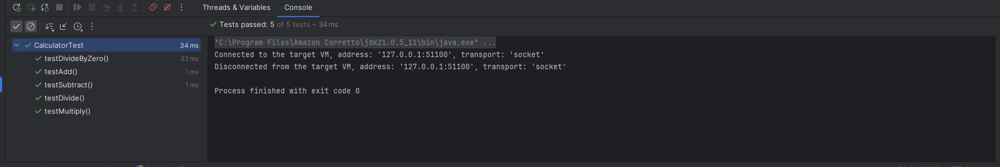

Here's a simple Java unit testing exercise:

# Exercise: Testing a Calculator Class

Create a test class CalculatorTest to verify the functionality of the Calculator class.

Calculator Class

```java
public class Calculator {
    public int add(int a, int b) {
        return a + b;
    }

    public int subtract(int a, int b) {
        return a - b;
    }

    public int multiply(int a, int b) {
        return a * b;
    }

    public double divide(double a, double b) {
        if (b == 0) {
            throw new ArithmeticException("Division by zero");
        }
        return a / b;
    }
}
```

# Your Task

Write test cases for the Calculator class using JUnit. Ensure you cover:

1. Happy paths (valid inputs)
2. Edge cases (e.g., division by zero)
3. Error handling

Sample Test Class Skeleton

# Answer

[source link](src/test/java/CalculatorTest.java).

# Result

